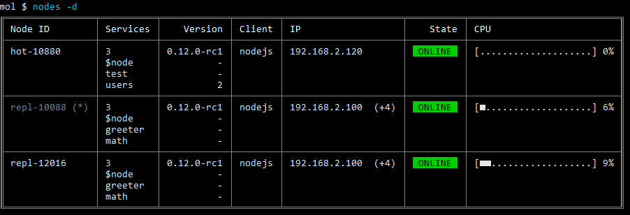
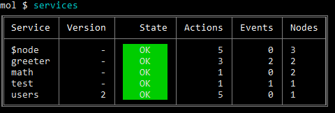
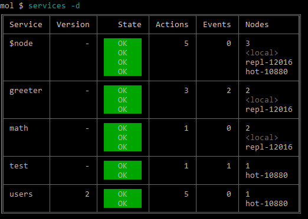
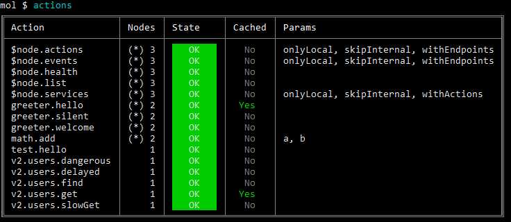
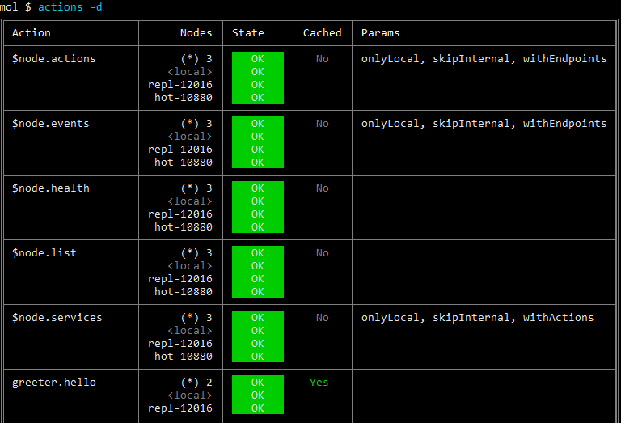
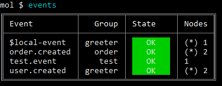
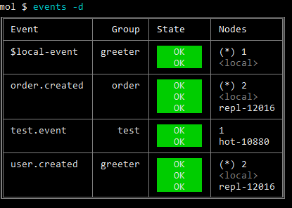
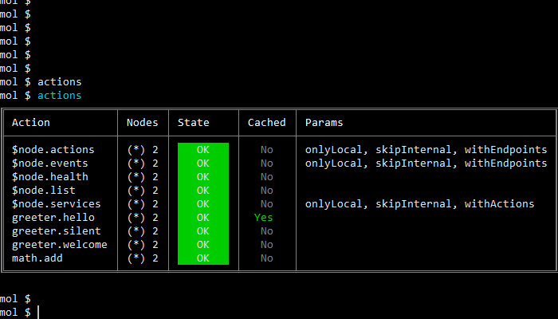

title: REPL console
---
## moleculer repl [](https://www.npmjs.com/package/moleculer-repl)
The [moleculer-repl](https://github.com/moleculerjs/moleculer-repl) is an interactive developer console for Moleculer.

## Install
```bash
npm i moleculer-repl
```

## Usage

**Switch broker to REPL mode**
```js
const broker = new ServiceBroker();

// Switch to REPL mode
broker.repl();
```

## REPL Commands

```
  Commands:
    help [command...]                                   Provides help for a given command.
    q                                                   Exit application
    actions [options]                                   List of actions
    bench [options] <action> [jsonParams]               Benchmark a service
    broadcast <eventName>                               Broadcast an event
    broadcastLocal <eventName>                          Broadcast an event locally
    call [options] <actionName> [jsonParams]            Call an action
    dcall [options] <nodeID> <actionName> [jsonParams]  Direct call an action
    clear [pattern]                                     Clear cache entries
    emit <eventName>                                    Emit an event
    env                                                 List of environment variables
    events [options]                                    List of event listeners
    info                                                Information about broker
    load <servicePath>                                  Load a service from file
    loadFolder <serviceFolder> [fileMask]               Load all services from folder
    nodes [options]                                     List of nodes
    services [options]                                  List of services
    hello [options] <name>                              Call the greeter.hello service with name
```

### List nodes
```bash
mol $ nodes
```

**Options**
```
    -a, --all             list all (offline) nodes
    -d, --details         detailed list
    -f, --filter <match>  filter nodes (e.g.: 'node-*')
    --raw                 print service registry to JSON
    --save [filename]     save service registry to a JSON file
```

**Output**


**Detailed output**


### List services
```bash
mol $ services
```

**Options**
```
    -a, --all             list all (offline) services
    -d, --details         print endpoints
    -f, --filter <match>  filter services (e.g.: 'user*')
    -i, --skipinternal    skip internal services
    -l, --local           only local services
```

**Output**


**Detailed output**


### List actions
```bash
mol $ actions
```

**Options**
```
    -a, --all             list all (offline) actions
    -d, --details         print endpoints
    -f, --filter <match>  filter actions (e.g.: 'users.*')
    -i, --skipinternal    skip internal actions
    -l, --local           only local actions
```

**Output**


**Detailed output**


### List events
```bash
mol $ events
```

**Options**
```
    -a, --all             list all (offline) event listeners
    -d, --details         print endpoints
    -f, --filter <match>  filter event listeners (e.g.: 'user.*')
    -i, --skipinternal    skip internal event listeners
    -l, --local           only local event listeners
```

**Output**


**Detailed output**



### Show common information
```bash
mol $ info
```

**Output**


### List environment variables
```bash
mol $ env
```

### Call an action
```bash
mol $ call "test.hello"
```

**Output**


#### Call an action with parameters
```bash
mol $ call "math.add" --a 5 --b Bob --c --no-d --e.f "hello"
```
Params will be `{ a: 5, b: 'Bob', c: true, d: false, e: { f: 'hello' } }`

#### Call with JSON string parameter
```bash
mol $ call "math.add" '{"a": 5, "b": "Bob", "c": true, "d": false, "e": { "f": "hello" } }'
```
Params will be `{ a: 5, b: 'Bob', c: true, d: false, e: { f: 'hello' } }`

#### Call with parameters from file
```bash
mol $ call "math.add" --load
```
It tries to load the `<current_dir>/math.add.params.json` file to params.

```bash
mol $ call "math.add" --load my-params.json
```
It tries to load the `my-params.jon` file to params.

#### Call and save response to file
```bash
mol $ call "math.add" --save
```
It saved the response to the `<current_dir>/posts.find.response.json` file. The extension is `.json` when the response is `object`. Otherwise it is `.txt`.

```bash
mol $ call "math.add" --save my-response.json
```
It saved the response to the `my-response.json` file.

### Direct call
Get health info from `node-12` node
```bash
mol $ dcall "node-12" "$node.health"
```
>Parameter passing is similar to `call` command.

### Emit an event
```bash
mol $ emit "user.created"
```

#### Emit an event with parameters
```bash
mol $ emit "user.created" --a 5 --b Bob --c --no-d --e.f "hello"
```
Params will be `{ a: 5, b: 'Bob', c: true, d: false, e: { f: 'hello' } }`

### Benchmark services

Moleculer REPL module has a new bench command to measure your services.

```bash
# Call service until 5 seconds (default)
mol $ bench math.add

# Call service 5000 times
mol $ bench --num 5000 math.add

# Call service until 30 seconds
mol $ bench --time 30 math.add
```

**Options**
```
    --num <number>     Number of iterates
    --time <seconds>   Time of bench
    --nodeID <nodeID>  NodeID (direct call)
```

**Output**



#### Parameters
Please note, parameters can be passed only as JSON string.
```bash
mol $ bench math.add '{ "a": 50, "b": 32 }'
```

### Load a service from file
```bash
mol $ load "./math.service.js"
```

### Load all services from a folder
```bash
mol $ load "./services"
```

### Custom commands
Custom REPL commands can be defined in broker options to extend Moleculer REPL commands.

```js
const broker = new ServiceBroker({
    logger: true,
    replCommands: [
        {
            command: "hello <name>",
            description: "Call the greeter.hello service with name",
            alias: "hi",
            options: [
                { option: "-u, --uppercase", description: "Uppercase the name" }
            ],
            types: {
                string: ["name"],
                boolean: ["u", "uppercase"]
            },
            //parse(command, args) {},
            //validate(args) {},
            //help(args) {},
            allowUnknownOptions: true,
            action(broker, args/*, helpers*/) {
                const name = args.options.uppercase ? args.name.toUpperCase() : args.name;
                return broker.call("greeter.hello", { name }).then(console.log);
            }
        }
    ]
});

broker.repl();
```

```bash
mol $ hello -u John
Hello JOHN
```
